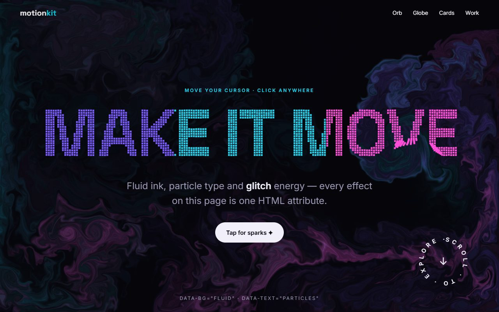
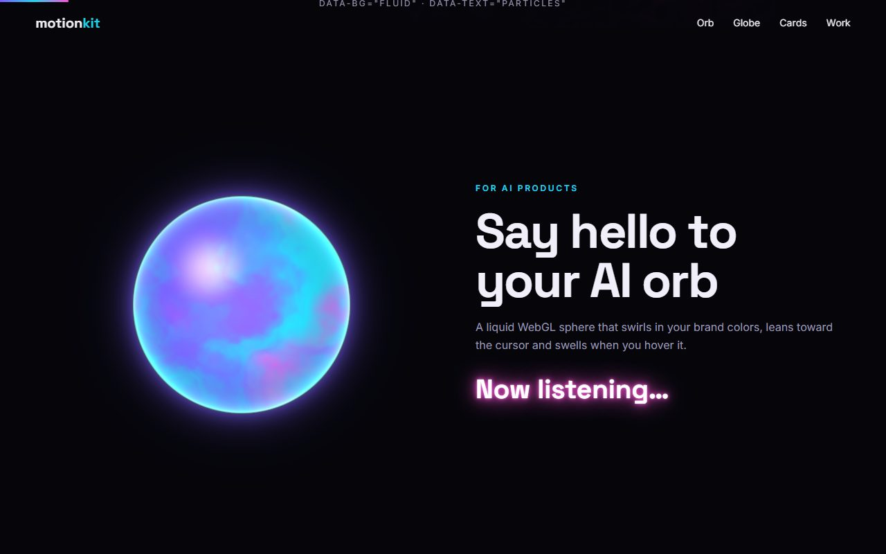
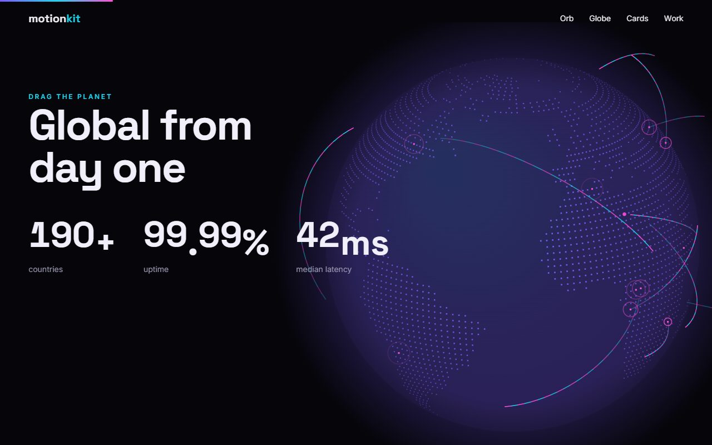
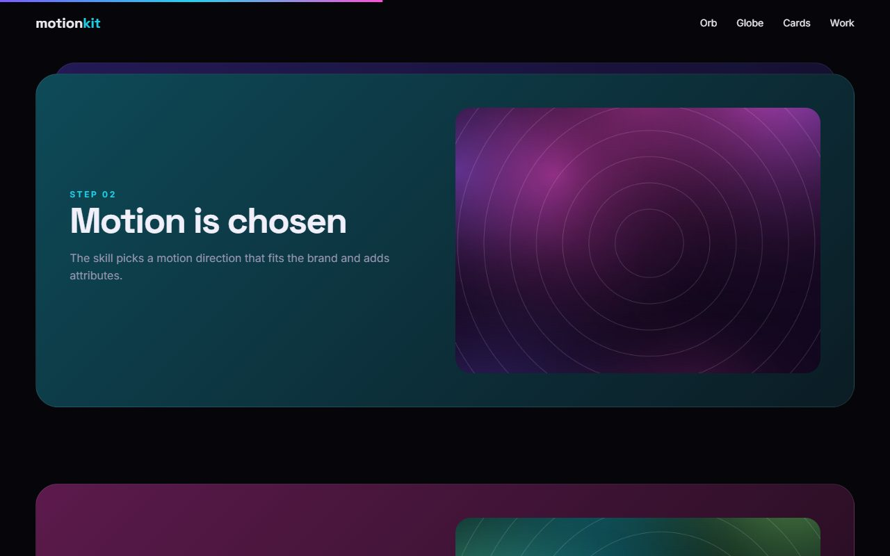
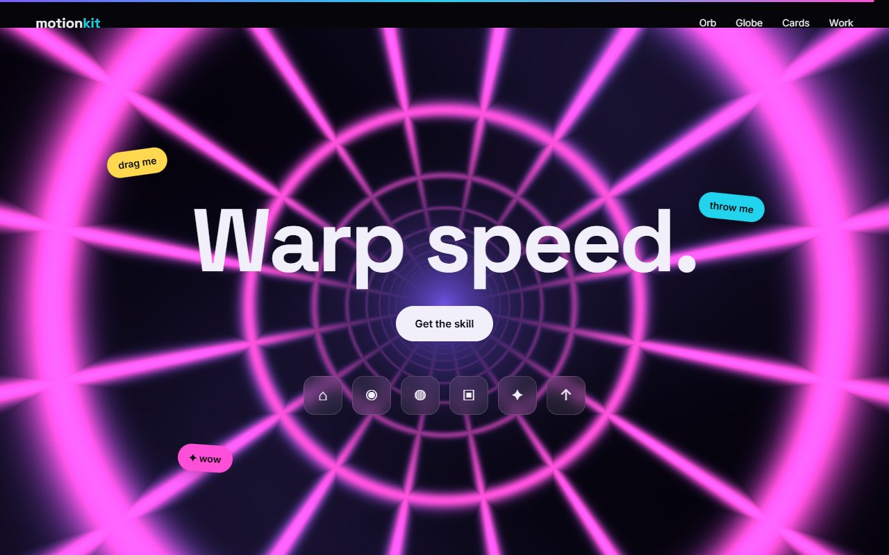
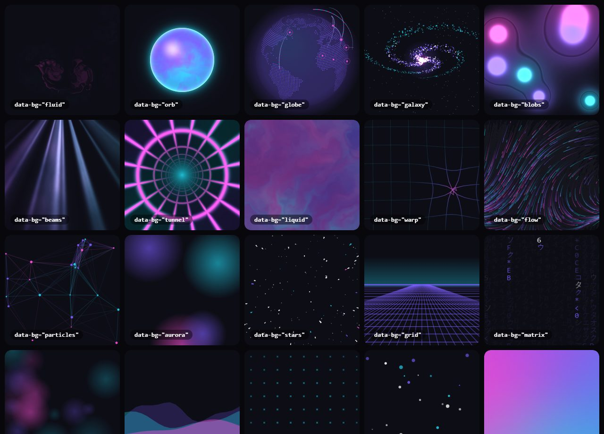
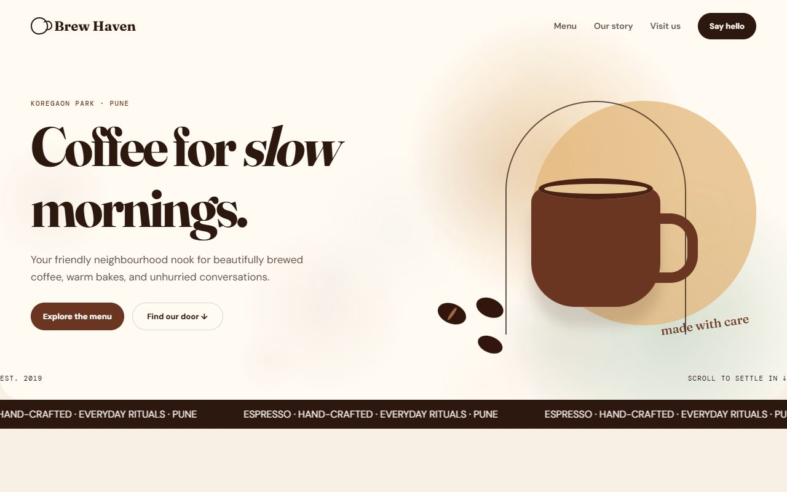

# Web Motion Graphics — an AI skill that makes every website move

**Ask your AI assistant for a website and it comes back alive.** This is an [Agent Skill](https://agentskills.io) that teaches Claude, ChatGPT, Codex, Gemini, Copilot and Cursor to add polished, eye-catching motion graphics to every website they build — automatically, even when you never mention animation.

It ships **Motion Kit**: a zero-dependency animation library with **100+ effects** that you (or the AI) switch on with plain HTML attributes, plus a CLI (Node **and** Python) that inlines only the effects a page uses and lints the result.



**Live demos:** [WOW effects](https://raw.githack.com/Nainesh-Shiyani/motion-graphic-skill-for-website-creation-using-claude/main/examples/wow/index.html) · [Showcase](https://raw.githack.com/Nainesh-Shiyani/motion-graphic-skill-for-website-creation-using-claude/main/examples/showcase/index.html) · [Site built by GPT](https://raw.githack.com/Nainesh-Shiyani/motion-graphic-skill-for-website-creation-using-claude/main/examples/ai-built/gpt-codex-coffee/index.html) · [Site built by Gemini](https://raw.githack.com/Nainesh-Shiyani/motion-graphic-skill-for-website-creation-using-claude/main/examples/ai-built/gemini-antigravity-coffee/index.html) (move your mouse around — most effects react to it)

---

## What you get

| | |
|---|---|
|  |  |
| **AI orb** — a liquid WebGL sphere that leans toward the cursor | **3D dotted globe** with real continents, glowing arcs, drag to spin |
|  |  |
| **Stacking cards** that pin and shrink as you scroll | **Neon wormhole** + draggable stickers + dock magnification |



- **30 scroll reveals** — fade, zoom, blur, 3D flip, swing, drop, glitch, blinds, shutter, diagonal wipe, iris, image zoom…
- **18 text effects** — particle headlines, masked word reveals, glitch, neon, typewriter, scramble, rotating words, 3D letter flip, hover roll, explode, cursor-proximity magnify, scroll-lit paragraphs, highlight sweep, rotating circular badge
- **21 animated backgrounds** — WebGL **fluid simulation**, **AI orb**, **lava-lamp blobs**, **light beams**, **wormhole**, liquid gradient; canvas **3D globe**, **galaxy**, **warp grid**, **flow-field art**, particles, starfield, synthwave grid, dot matrix, bokeh, snow, code rain, waves; CSS aurora, mesh gradient, film grain
- **Interactions** — holographic foil cards, 3D tilt with depth layers, magnetic buttons, spotlight card grids, flashlight reveal, 3D ring carousel, macOS-style dock, drag-and-throw stickers, click sparks, ripples, confetti
- **Cursors** — ring, dot, blend, gooey blob; glow / sparkle / comet trails; image trails; hover image previews
- **Scroll storytelling** — stacking cards, full-screen expanding media, pinned horizontal galleries, scrollytelling steps, parallax, velocity skew, scroll-scrubbed scenes, page colour shifts, progress bar
- **Numbers & more** — count-up and **odometer** stats, marquees, SVG line drawing, intro loaders (curtain, split, circle, columns…), page transitions, 22 CSS-only utility effects

Everything respects `prefers-reduced-motion`, pauses off-screen, keeps text readable for screen readers and works without JavaScript (content simply shows).

## Install

Pick your tool. You only need one of these.

| AI tool | How to install |
|---|---|
| **Claude Code** (terminal + desktop app) | In Claude Code: `/plugin marketplace add Nainesh-Shiyani/motion-graphic-skill-for-website-creation-using-claude` then `/plugin install web-motion-graphics@motion-graphics` — or use the one-line installer below |
| **Claude.ai** | Download [`dist/web-motion-graphics.zip`](dist/web-motion-graphics.zip) → Settings → Capabilities → Skills → **Upload skill** (code execution must be on) |
| **ChatGPT** | Skills → Create → **Upload** the same [`web-motion-graphics.zip`](dist/web-motion-graphics.zip) |
| **OpenAI Codex** (CLI / app) | One-line installer below (copies to `~/.agents/skills`) |
| **Gemini CLI** | `gemini extensions install https://github.com/Nainesh-Shiyani/motion-graphic-skill-for-website-creation-using-claude` |
| **Google Antigravity** (IDE + CLI) | One-line installer below (copies to `~/.gemini/config/skills` and `~/.gemini/antigravity-cli/skills`) |
| **GitHub Copilot / Cursor** | One-line installer below (`~/.agents/skills`), or copy `skills/web-motion-graphics` into your project's `.agents/skills/` |
| **Any other chatbot** (custom GPT, Gemini Gem…) | Paste [`SKILL.md`](skills/web-motion-graphics/SKILL.md) into its instructions; it will load the kit from the CDN (see [frameworks.md §9](skills/web-motion-graphics/references/frameworks.md)) |

**One-line installer** — installs for Claude Code, Codex, Gemini CLI, Copilot, Cursor and Antigravity at once:

```bash
curl -fsSL https://raw.githubusercontent.com/Nainesh-Shiyani/motion-graphic-skill-for-website-creation-using-claude/main/install.sh | bash
```

```powershell
irm https://raw.githubusercontent.com/Nainesh-Shiyani/motion-graphic-skill-for-website-creation-using-claude/main/install.ps1 | iex
```

Or clone the repo and run `./install.sh` (macOS, Linux, Git Bash) or `powershell -ExecutionPolicy Bypass -File .\install.ps1` (Windows). To install for only some tools add `claude`, `agents` or `antigravity` (`./install.sh claude agents` / `-Targets claude,agents`); `--uninstall` / `-Uninstall` removes it. Start a new session afterwards.

## Try it

Just ask for a website the way you normally would:

> *"Create a landing page for my coffee shop Brew Haven in Pune — menu, story, hours and contact. Single index.html."*

> *"Build me a dark portfolio site for a 3D artist and indie game developer."*

> *"Make an insanely eye-catching launch page for my AI note-taking app."*

The AI picks a **motion direction** that fits the brand (calm & elegant, warm & friendly, bold, futuristic, playful, corporate, portfolio or gaming), adds Motion Kit attributes, runs `motion-kit inline` to embed exactly the effects used, runs `motion-kit check` to catch mistakes, and tells you how to tone it down.

## Tested with real AIs

The same prompt (*"Create a landing page for my coffee shop Brew Haven in Pune…"*, no mention of animation) was given to two different AI coding agents with this skill installed:

| GPT (OpenAI Codex CLI) | Gemini (Google Antigravity CLI, Gemini 3.8 Flash) |
|---|---|
|  |  |
| Picked the skill on its own (*"I'm using the web-motion-graphics skill…"*), built the page, ran `inline` + `check`, verified with headless Chrome. **8 kinds of motion**, lint clean, 0 console errors. | Read the skill and its recipes, built the page, ran `inline` + `check`, fixed what the linter flagged. **10 kinds of motion**, lint clean, 0 console errors. |

Both pages are in [`examples/ai-built/`](examples/ai-built/) (the kit inside them was later refreshed to v2.0.0). The skill uses the open Agent Skills format, so Claude Code and Claude.ai load exactly the same folder; `claude plugin validate` passes on this repo.

## Use Motion Kit without an AI

Drop the prebuilt files into any page:

```html
<head>
  <script>document.documentElement.classList.add('mk-js');setTimeout(function(){if(!window.MotionKit)document.documentElement.classList.remove('mk-js')},4000)</script>
  <link rel="stylesheet" href="https://cdn.jsdelivr.net/gh/Nainesh-Shiyani/motion-graphic-skill-for-website-creation-using-claude@main/skills/web-motion-graphics/assets/dist/motion-kit.min.css">
  <script src="https://cdn.jsdelivr.net/gh/Nainesh-Shiyani/motion-graphic-skill-for-website-creation-using-claude@main/skills/web-motion-graphics/assets/dist/motion-kit.min.js" defer></script>
</head>
<body>
  <header data-bg="fluid">
    <h1 data-text="particles">HELLO</h1>
    <a class="btn" data-magnetic data-burst href="#start">Get started</a>
  </header>
  <div class="cards" data-motion-children="rise-3d">
    <div class="card" data-holo data-tilt="12">…</div>
    <div class="card" data-holo data-tilt="12">…</div>
  </div>
  <b data-count-to="12500" data-count-style="odometer" data-count-suffix="+">12,500+</b>
</body>
```

Or use the CLI, which inlines only what the page needs:

```bash
node skills/web-motion-graphics/scripts/motion-kit.mjs inline index.html     # or: python3 .../motion_kit.py inline index.html
node skills/web-motion-graphics/scripts/motion-kit.mjs check index.html      # typos ("did you mean"), sticky breakers, missing kit…
node skills/web-motion-graphics/scripts/motion-kit.mjs react --out src/lib    # React / Next.js: useMotionKit() hook
node skills/web-motion-graphics/scripts/motion-kit.mjs list                   # every effect and valid value
```

Full attribute reference: [`effects-catalog.md`](skills/web-motion-graphics/references/effects-catalog.md) · Design recipes: [`motion-directions.md`](skills/web-motion-graphics/references/motion-directions.md) · Frameworks & AI tools: [`frameworks.md`](skills/web-motion-graphics/references/frameworks.md) · GSAP / Three.js / custom shaders: [`advanced.md`](skills/web-motion-graphics/references/advanced.md)

## How it's organised

```
skills/web-motion-graphics/        the skill (this folder is what gets installed)
├── SKILL.md                       instructions the AI follows
├── agents/openai.yaml             Codex / ChatGPT display metadata
├── references/                    recipes, effect catalog, frameworks, advanced
├── scripts/motion-kit.mjs         CLI (Node 16+)
├── scripts/motion_kit.py          identical CLI (Python 3.8+, standard library only)
└── assets/
    ├── src/                       Motion Kit source modules + manifest.json
    ├── min/                       pre-minified modules (small inline bundles)
    └── dist/                      prebuilt full bundles (motion-kit[.min].js/css)
.claude-plugin/marketplace.json    Claude Code plugin marketplace
gemini-extension.json              Gemini CLI extension
install.sh / install.ps1           one-line installers
dist/web-motion-graphics.zip       upload file for Claude.ai and ChatGPT
examples/                          showcase, WOW demo, sites built by GPT and Gemini
tests/                             CLI tests, Python parity tests, headless-browser suites
```

## Development

```bash
npm install          # esbuild (minifier) + pyodide (runs the Python CLI tests without Python)
npm run build        # rebuild assets/min, assets/dist and dist/web-motion-graphics.zip
npm test             # everything below
node tests/run-cli-tests.mjs       # 33 CLI + packaging/spec tests
node tests/run-python-parity.mjs   # 98 checks: Python CLI output is byte-identical to Node's
node tests/run-kit-tests.mjs       # headless Chrome/Edge: 127 in-page tests x 3 build types, normal + reduced motion,
                                   # loaders, page transitions, React hook, docs snippets (GSAP, Three.js, custom shaders)
node tools/serve.mjs 5178          # preview examples at http://localhost:5178/examples/wow/
```

Add an effect: write `assets/src/modules/<name>.js` (+ `.css`), register it in `assets/src/manifest.json` (with the attributes/classes that trigger it), then `npm run build && npm test`.

## Credits & license

MIT © 2026 Nainesh Shiyani. Globe land data: [Natural Earth](https://www.naturalearthdata.com/) (public domain) via [world-atlas](https://github.com/topojson/world-atlas). All effects are original implementations; no third-party animation code is bundled.
